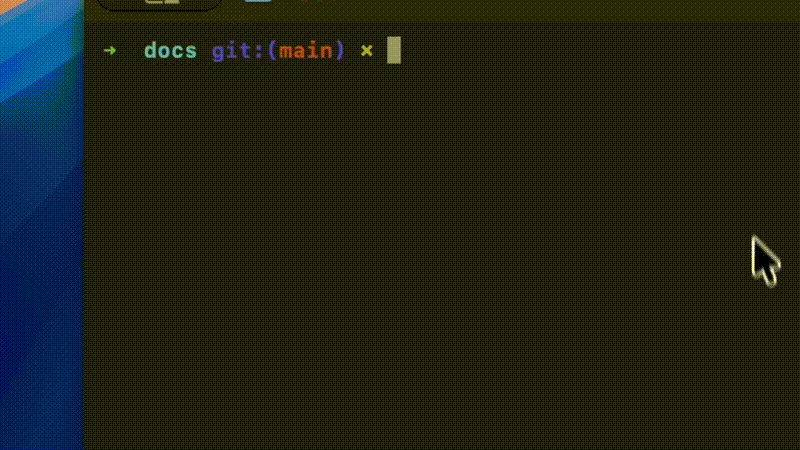

<div align="center">

# ✨ OpenMagic

**AI-powered coding toolbar for any web application**

Add AI code editing to your existing web app in one command. No IDE extension, no desktop app, no account required.

[](https://www.npmjs.com/package/openmagic)
[](https://opensource.org/licenses/MIT)

[Quick Start](#quick-start) | [How It Works](#how-it-works) | [Providers](#supported-providers) | [Configuration](#configuration) | [Contributing](#contributing)

</div>

---

## What is OpenMagic?

OpenMagic is an open-source npm package that injects a floating AI coding toolbar into your running web application during development. Select elements, capture screenshots, send context to any LLM, and apply code changes that reflect instantly via hot reload.

**Works with any framework.** React, Vue, Angular, Svelte, Next.js, Nuxt, Vite, plain HTML — if it runs in a browser, OpenMagic works.

### The Developer Experience

```
1. You have an existing web app running on localhost:3000
2. Run `npx openmagic`
3. A floating toolbar appears in your app
4. Select a button → "Make it bigger with a gradient"
5. AI proposes changes → You approve → Code updates → UI refreshes
```

<!-- TODO: Add demo GIF here -->
<!--  -->

## Quick Start

Make sure your dev server is running first (e.g., `npm run dev`), then:

```bash
npx openmagic@latest
```

That's it. OpenMagic auto-detects your dev server and opens a proxied version with the toolbar injected.

### Specify a port

```bash
npx openmagic --port 3000
```

### Multiple project roots (e.g., frontend + backend)

```bash
npx openmagic --port 3000 --root ./frontend --root ./backend
```

## How It Works

OpenMagic runs a **reverse proxy** between your browser and your dev server. This is completely non-invasive — your project files are never modified by the install.

```
┌─────────────────────────────────────────────────┐
│                   Your Browser                   │
│              http://localhost:4567                │
├─────────────┬───────────────────┬───────────────┤
│  Your App   │   OpenMagic       │  WebSocket    │
│  (proxied)  │   Toolbar (UI)    │  Connection   │
└──────┬──────┴───────────────────┴───────┬───────┘
       │                                  │
       ▼                                  ▼
┌──────────────┐              ┌───────────────────┐
│  Your Dev    │              │  OpenMagic Server  │
│  Server      │              │  ┌──────────────┐  │
│  :3000       │              │  │ File System   │  │
└──────────────┘              │  │ Read/Write    │  │
                              │  ├──────────────┤  │
                              │  │ LLM Proxy     │  │
                              │  │ (your API key)│  │
                              │  └──────────────┘  │
                              └───────────────────┘
```

1. **Proxy** — All HTTP requests are forwarded to your dev server. HTML responses get the toolbar `<script>` injected before `</body>`.
2. **Toolbar** — A Shadow DOM Web Component that floats on top of your app. Completely isolated — no CSS conflicts with your app.
3. **Server** — A local Node.js server that handles file operations and proxies LLM API calls. Your API keys never leave localhost.
4. **HMR** — When AI modifies your source files, your dev server's hot module replacement picks up the changes automatically.

### What happens when you stop?

```bash
Ctrl+C
```

Everything stops. No files modified. No dependencies added. No traces left in your project.

## Features

### Element Selection
Click any element in your app to capture its DOM structure, computed styles, and surrounding HTML. This context is sent to the LLM so it knows exactly what to modify.

### Screenshot Capture
Take a screenshot of the page or a specific element. Vision-capable models (GPT-4o, Claude, Gemini) use this to understand the visual layout.

### Network & Console Logs
OpenMagic automatically captures `fetch`/`XHR` requests and `console.log` output. This context helps the LLM understand API responses, errors, and application state.

### Multi-Repo Context
Working on a fullstack app? Add both your frontend and backend directories:

```bash
npx openmagic --root ./my-frontend --root ./my-api
```

The LLM can read and modify files across both repositories.

### Streaming Responses
LLM responses stream in real-time. You see the AI thinking as it generates code.

### Code Modifications
The AI returns structured edits (search/replace on source files). Changes are applied directly and your dev server's HMR reflects them instantly.

## Supported Providers

All providers and models are pre-configured. You only need to:
1. Select a provider from the dropdown
2. Pick a model
3. Paste your API key

| Provider | Models | Vision | Thinking | API Key |
|----------|--------|--------|----------|---------|
| **OpenAI** | GPT-5.4, GPT-5.4 Pro/Mini/Nano, GPT-5.2, o3, o4-mini, Codex Mini | Yes | reasoning_effort: none/low/medium/high/xhigh | [platform.openai.com](https://platform.openai.com/api-keys) |
| **Anthropic** | Claude Opus 4.6, Sonnet 4.6, Haiku 4.5, Opus 4.5, Sonnet 4.5, Sonnet 4, Opus 4 | Yes | Extended thinking: budget_tokens | [console.anthropic.com](https://console.anthropic.com/) |
| **Google Gemini** | Gemini 3.1 Pro, 3 Flash, 3.1 Flash Lite, 2.5 Pro, 2.5 Flash, 2.5 Flash Lite | Yes | thinking_level: LOW/MEDIUM/HIGH | [aistudio.google.com](https://aistudio.google.com/apikey) |
| **xAI (Grok)** | Grok 4.20, Grok 4.20 Reasoning, Grok 4.1 Fast, Grok 4.1 Fast Reasoning | Yes | reasoning_effort: low/medium/high | [console.x.ai](https://console.x.ai/) |
| **DeepSeek** | DeepSeek V3.2, DeepSeek R1 | No | R1: reasoning_effort | [platform.deepseek.com](https://platform.deepseek.com/) |
| **Mistral** | Large 3, Small 4, Codestral, Devstral 2, Magistral Medium/Small | Yes | Magistral: reasoning_effort | [console.mistral.ai](https://console.mistral.ai/) |
| **Groq** | Llama 4 Scout 17B, Llama 3.3 70B, Llama 3.1 8B, Qwen 3 32B | Llama 4 | - | [console.groq.com](https://console.groq.com/) |
| **Ollama** | Any local model | Varies | - | Not required (local) |
| **OpenRouter** | 200+ models | Varies | Varies | [openrouter.ai](https://openrouter.ai/) |

> **Thinking/Reasoning models** use their default thinking level automatically. Models like GPT-5.4, Claude Opus 4.6, and Gemini 3.1 Pro will use their built-in reasoning capabilities to produce better code modifications.

### Using Ollama (Free, Local)

Run any model locally with zero API costs:

```bash
# Install Ollama
curl -fsSL https://ollama.com/install.sh | sh

# Pull a model
ollama pull llama3.3

# Start openmagic and select "Ollama (Local)" as provider
npx openmagic --port 3000
```

## Configuration

### CLI Options

| Option | Description | Default |
|--------|-------------|---------|
| `-p, --port <port>` | Dev server port to proxy | Auto-detect |
| `-l, --listen <port>` | OpenMagic proxy port | `4567` |
| `-r, --root <paths...>` | Project root directories | Current directory |
| `--host <host>` | Dev server host | `127.0.0.1` |
| `--no-open` | Don't auto-open browser | `false` |

### Config File

Settings are stored in `~/.openmagic/config.json`:

```json
{
  "provider": "anthropic",
  "model": "claude-sonnet-4-20250514",
  "apiKey": "sk-ant-...",
  "roots": ["/path/to/project"]
}
```

This file is in your home directory, never in your project. It won't be committed to git.

## Security

- **Localhost only** — The proxy and WebSocket server bind to `127.0.0.1`. They are not accessible from the network.
- **Session tokens** — Each session generates a random token. The toolbar must authenticate before accessing any APIs.
- **Path sandboxing** — File operations are restricted to configured root directories. The server cannot read/write outside your project.
- **API keys stay local** — Keys are stored in `~/.openmagic/config.json` on your machine. They are proxied through the local server and never exposed to the browser or any third party.
- **Zero project modification** — OpenMagic never modifies your `package.json`, config files, or source code during installation. The toolbar exists only in the proxy layer.

## Comparison

| Feature | OpenMagic | Stagewise | Frontman | Agentation |
|---------|-----------|-----------|----------|------------|
| Install method | `npx openmagic` | npm package / Electron app | Framework middleware | npm package |
| Framework support | Any (reverse proxy) | React, Vue, Angular, Svelte | Next.js, Astro, Vite | React |
| Code modification | Yes (auto-apply) | Yes (via IDE) | Yes | No (clipboard only) |
| BYOK (Bring Your Own Key) | Yes | Paid tiers | Yes | N/A |
| Prompt limits | None | 10 free/day | None | N/A |
| Vision (screenshots) | Yes | Yes | No | No |
| Network/console logs | Yes | No | Yes (server-side) | No |
| Multi-repo | Yes | No | No | No |
| IDE required | No | VS Code extension | No | No |
| Open source | MIT | Partial | Apache 2.0 | MIT |

## Framework Compatibility

OpenMagic works via a reverse proxy, so it's compatible with **any** framework or tool that serves HTML:

- React (CRA, Vite)
- Next.js
- Vue (Vue CLI, Vite)
- Nuxt
- Angular
- Svelte / SvelteKit
- Astro
- Remix
- Solid
- Qwik
- Ember
- Django / Flask templates
- Rails views
- PHP (Laravel, WordPress)
- Plain HTML + any HTTP server

## Contributing

```bash
# Clone the repo
git clone https://github.com/Kalmuraee/OpenMagic.git
cd openmagic

# Install dependencies
npm install

# Build (CLI + Toolbar)
npm run build

# Test locally against a dev server running on port 3000
node dist/cli.js --port 3000
```

### Project Structure

```
src/
  cli.ts              # CLI entry point (commander)
  proxy.ts            # Reverse proxy + HTML injection
  server.ts           # WebSocket + HTTP server
  filesystem.ts       # Safe file read/write
  config.ts           # User config management
  security.ts         # Session tokens
  detect.ts           # Dev server auto-detection
  shared-types.ts     # TypeScript interfaces
  llm/
    registry.ts       # Pre-configured provider/model list
    proxy.ts          # Routes to correct provider adapter
    openai.ts         # OpenAI-compatible adapter
    anthropic.ts      # Anthropic adapter
    google.ts         # Google Gemini adapter
    prompts.ts        # System prompts for code modification
  toolbar/
    index.ts          # Web Component (Shadow DOM)
    services/
      ws-client.ts    # WebSocket client
      dom-inspector.ts # Element inspection
      capture.ts      # Screenshot capture
      context-builder.ts # Assembles LLM context
    styles/
      toolbar.css.ts  # Scoped styles
```

## Roadmap

- [ ] Diff viewer with approve/reject per-file
- [ ] Undo/rollback for applied changes
- [ ] File tree browser in toolbar
- [ ] Voice input
- [ ] Keyboard shortcuts
- [ ] Plugin system for custom context providers
- [ ] Collaborative editing (multiple developers)
- [ ] Git integration (auto-branch, auto-commit)
- [ ] VS Code extension for side-by-side view

## Author

**Khalid Almuraee** ([@kalmuraee](https://github.com/kalmuraee))

## License

MIT - Copyright (c) 2026 Khalid Almuraee. See [LICENSE](./LICENSE) for details.

---

<div align="center">

**Built with love for developers who vibe code on their own terms.**

[Report a Bug](https://github.com/Kalmuraee/OpenMagic/issues) | [Request a Feature](https://github.com/Kalmuraee/OpenMagic/issues)

</div>
